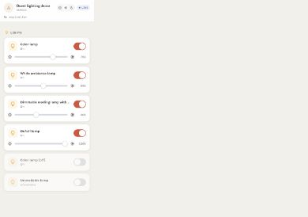
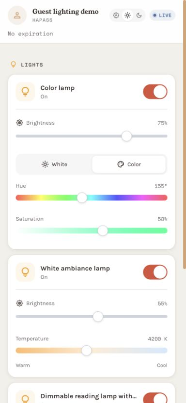
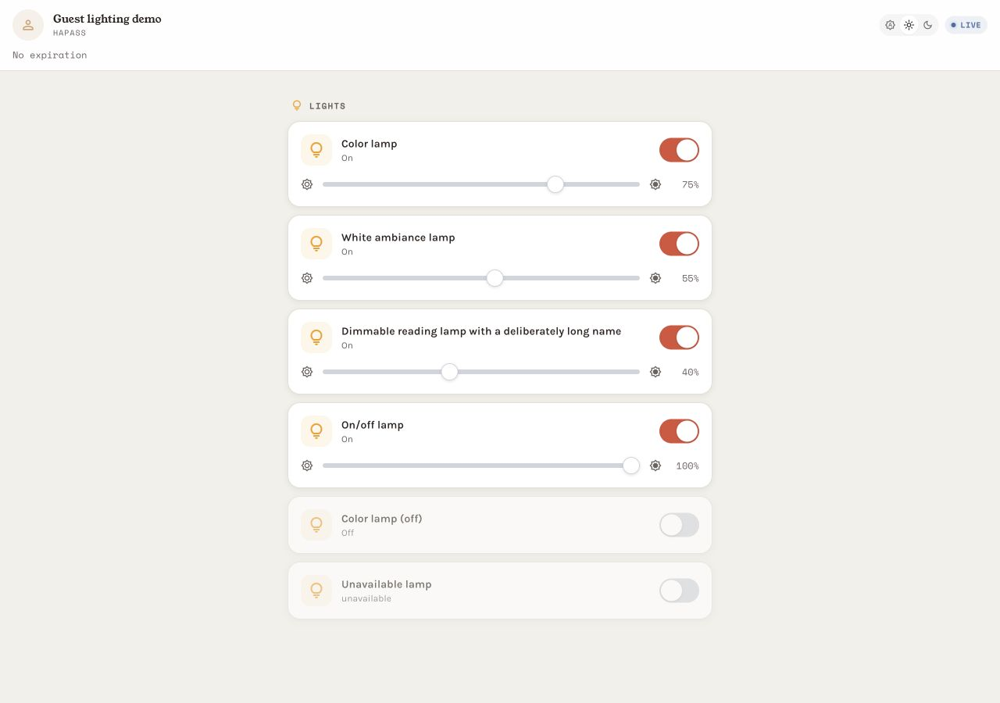
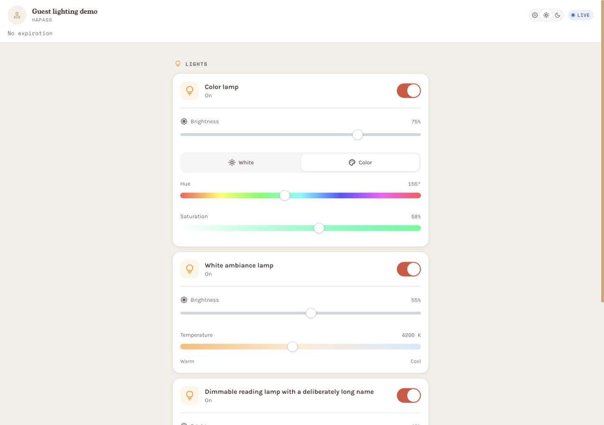
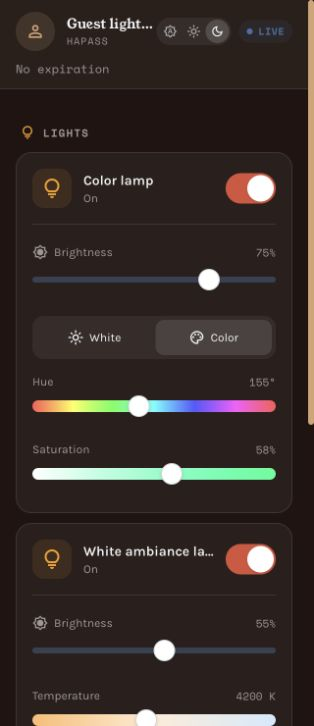
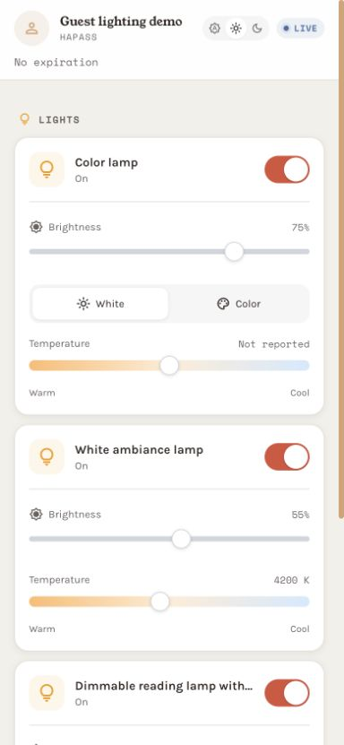

# HAPass guest lighting controls: visual evidence

Browser captures for [upstream PR #25](https://github.com/Rohithkadaveru/ha-pass/pull/25), recorded on 2026-09-13.

- Before: `ed90194b54863d661eea23bddd52387e89f23b08` (upstream main).
- After: `d238246e90e29ff84fb4f74717eb30ab9aa29b26` (feature branch).
- Real repository Jinja templates and static JavaScript, with CSS compiled using Tailwind 3.4.16 as pinned in the Dockerfile.
- Synthetic device states, command receiver and SSE stream supplied by `preview.py`. No Home Assistant client, household data or access tokens are used.
- Captured with the Codex in-app browser at 390 × 844 and 1280 × 900 for before/after, and 320 × 740 for the narrow dark-theme check. Images are unedited browser captures; capture dimensions can exclude the scrollbar.

## Before / after

| 390 px viewport — before | 390 px viewport — after |
| --- | --- |
|  |  |

| 1280 px viewport — before | 1280 px viewport — after |
| --- | --- |
|  |  |

| 320 px, dark theme | White controls, unreported temperature |
| --- | --- |
|  |  |

## Behavior and results

- Hue and saturation are always visible in the Color panel. Brightness remains separate. Labels and the saturation gradient preview changes on input; commands are sent on the native range change event, without an Apply button or browser color-picker dialog.
- Lights supporting both color and temperature get White/Color buttons. These select the controls to edit; selecting a panel alone does not send a lamp command. The initial panel follows the reported color mode, and an explicit panel choice stays selected for the page session.
- Inspected padding, spacing, truncation and control alignment at 320, 390 and 1280 px in light and dark themes. No overlapping controls or horizontal overflow was observed. At 320 px, the document layout and scroll widths both measured 314 px (excluding the scrollbar); all three light-control groups had matching 248 px layout and scroll widths.
- Checked the UI for combined RGB/temperature, temperature-only, brightness-only, on/off-only, off and unavailable lights. Unsupported controls are absent.
- Keyboard End on Hue reached 359 degrees and sent `rgb_color: [255, 107, 110]` at 58% saturation. Home on Saturation sent `rgb_color: [255, 255, 255]`. Color commands omitted brightness and kept the existing `light.turn_on` request shape.
- While Saturation held focus at 0% with Hue at 359 degrees, an injected SSE event reporting 210 degrees / 80% did not move either control. Moving focus away reconciled both controls to that state.
- White controls showed `Not reported` in the visible label and `aria-valuetext` when the fixture did not report a current temperature. The slider still has a starting position; it is not presented as a measured value. Home/End reached 2000 K / 6500 K and the receiver recorded those exact requests. A separate brightness change recorded `brightness: 194`.
- No browser console warnings or errors were recorded during the after-version checks. Fonts and icons rendered.
- Feature commit validation: 135 Python tests passed (32 existing httpx cookie deprecation warnings); `node tests/test_light_controls.js` and `git diff --check` passed. JavaScript checks cover capability filtering, HS/RGB/RGBW/RGBWW/XY state conversion, independent brightness, zero saturation, invalid commands, Kelvin and legacy mired bounds, escaping, panel selection, focused controls and deferred off-state reconciliation.

These checks establish rendering and browser-to-fixture behavior. Physical-phone touch behavior, PWA installation and live Home Assistant/light operation were not exercised for this revision. No saved palette or recent-colors feature is included.

## Reproduce the preview

Place exact checkouts in `before/` and `after/` beside `preview.py`, using the commits above. Build `static/dist.css` in each checkout with the repository's pinned Tailwind 3.4.16 and `tailwind.config.js`, and run `generate_icons.py` with Python 3.12. Use the dependencies in the repository's `requirements.txt`.

Run `python preview.py` and open `http://127.0.0.1:8765/g/before` and `http://127.0.0.1:8765/g/after`. The fixture binds only to loopback. `/preview/reset` resets only its in-memory synthetic states; `/preview/state/{variant}/{entity}` injects a synthetic SSE update. Commands are recorded locally in `commands.jsonl` and never forwarded to Home Assistant.

For the White-panel screenshot, select White on the color lamp. The fixture deliberately reports no current Kelvin value while that lamp is in RGB mode.

This asset branch is separate from the product PR so screenshots and the preview harness do not enter the application diff.
